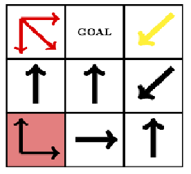

# Alice Mazes Solver
Alice Mazes (http://www.logicmazes.com/alice.html) are puzzles created by Robert Abbott. They are based on Lewis Carroll's Alice In Wonderland where Alice grows and shrinks during the story. Click [here](http://www.logicmazes.com/alice.html) to learn more about Alice Mazes. This program is designed to solve any arbitrary Alice maze.

## Rules of Alice Mazes
Rules of Alice Mazes are as follows (From [official page](http://www.logicmazes.com/alice.html)):
You start this maze on the red square, and your current position is always shown in red. You must make a series of moves that will take you to the goal. Begin each move by following one of the arrows in the red square, travel in a straight line for a distance equal to <b>d</b>, and then click on the square where your move ends.

When the maze begins, <b>d</b> equals 1. When you land on a square with a red arrow, 1 is added to <b>d</b>. When you land on a square with a yellow arrow, 1 is subtracted from <b>d</b>. If the mazes have blank squares, you may not land on them.

## How it works?
This solver uses Breadth-First-Search(BFS) to find the shortest path from the starting position. It keeps track of all positions with step size that are visited by the algorithm using a hashmap to ensure no same path is explored twice.

## Usage
1. Create a concise text representation of an Alice maze and save it in the same folder as AliceMazeSolver.py. Click [here] for more detail on format of text representation.
2. Run <b>python3 AliceMazeSolver.py maze.txt</b> where maze.txt is the text representation of an Alice maze you would like to solve.

## Text Representation of Alice Maze
The maze will be represented as a grid using an (y,x) coordinate system to represent each cell/position,
where y is the vertical, and x is the horizontal. The top left grid will always be represented as (0, 0).

Using this concept, the maze representation in a the text file will follow a certain format. 
First line will always be a number represents the number of row/column in the maze. 
Second line will always be the coordinate of the start position.
Starting from the third line, each line represents a a cell in the maze. There will be row * col-
umn number of lines to represent each cell in the maze and the order will
be from Top to Bottom, Left to Right. Therefore the third line of the text file always represents the
top left cell of maze and last line of the the text file always represents the bottom right cell of maze.

Each cell will always be formatted in "color; direction; isGoal". color represents the color of the
arrow. direction is where each arrow in the cell is pointing to. There are 8 possible directions for the arrows (N, E,
W, S, NE, NW, SE, SW), each representing a direction like a conventional compass would. Each
direction is separated with a comma. isGoal is either "true" or "false", it will be "true" if the cell
is a goal, otherwise it will be "false". 

Two examples of text representation of Alice maze is in the repo, the image of the two Alice mazes are shown below.

Text representation of this maze is example_maze1.txt

Text representation of this maze is example_maze2.txt

## Disclaimer
This program is only a solver for any arbitrary Alice Mazes, all concept and design of Alice Mazes are copyright by Robert Abbott as outlined on the [official website](http://www.logicmazes.com/alice.html) of Alice Maze.